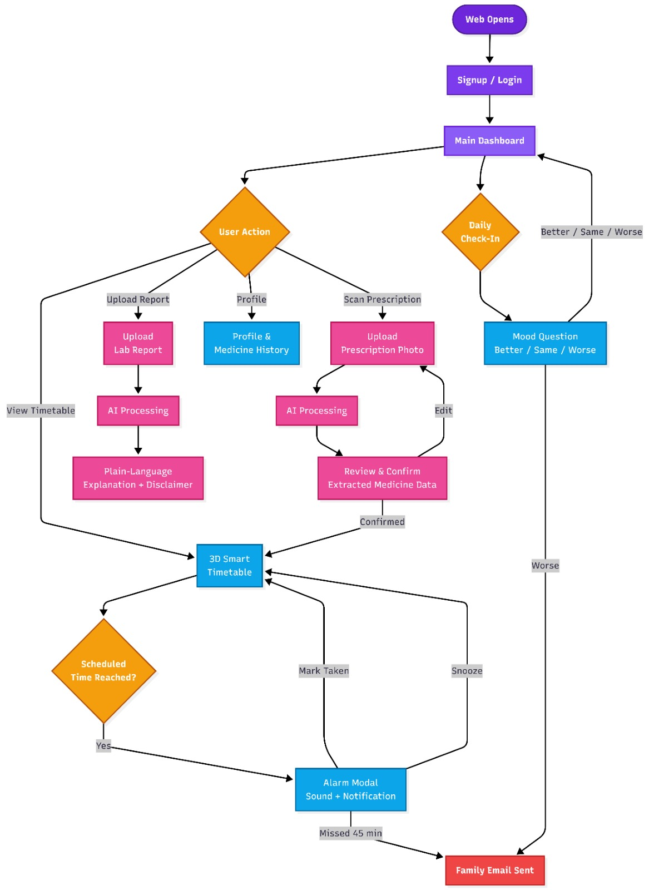

# MedRemind-AI

An elderly‑friendly web application that helps users manage medications, understand prescriptions and lab reports, and stay connected with family caregivers. It combines AI‑assisted image understanding with a mandatory human confirmation step to ensure safety in a medical context.

---

## Table of Contents

- [Features](#features)
- [Tech Stack](#tech-stack)
- [System Architecture](#system-architecture)
- [Core Flows](#core-flows)
- [Getting Started](#getting-started)
  - [Prerequisites](#prerequisites)
  - [Frontend Setup](#frontend-setup)
  - [Backend Setup](#backend-setup)
- [Environment Variables](#environment-variables)
- [How It Works](#how-it-works)
- [Future Scope](#future-scope)
- [License](#license)

---

---

## Demo

-  *3-min Quick Demo* [Watch here](https://youtube.com/shorts/D3hgfD5aCcc?si=TrWmfqX9IfsbUAwy) : A fast walkthrough of the core flow: scan a prescription, view the smart timetable, and see an alarm fire
-  *Full Walkthrough* [Watch here](https://youtu.be/YyhzuLdfHPY) : A detailed tour covering every feature, including lab report analysis, family alerts, and the AI companion check-in


---

## Features

- **Smart Medication Scheduling**  
  A visual 3D timetable that automatically adjusts when meal times change. Doses are displayed clearly and reminders are triggered at the right time.

- **AI‑Assisted Prescription Scanning**  
  Upload a photo of a prescription. The AI reads medicine names, dosages, and timing directly. Extracted data is shown in an editable confirmation screen before it becomes an active schedule.

- **Plain‑Language Lab Report Explanation**  
  Upload a lab report. The AI translates medical jargon into everyday language, with a clear non‑diagnostic disclaimer.

- **Timely Alarms & Notifications**  
  The app monitors the medication schedule and triggers a popup, sound, and browser notification when a dose is due. *(The polling interval is configurable; a short interval is used during development/testing.)*

- **Family & Emergency Alerts**  
  If a dose is not marked as taken within 45 minutes, the backend sends an email to the registered family contact. A daily mood check‑in can also trigger an immediate alert if the user indicates they are feeling worse.

- **Elderly‑First Interface**  
  Large fonts, high contrast, simple navigation, and a calm violet/lavender glassmorphism aesthetic.

---

## Tech Stack

| Layer          | Technology                                                                 |
|----------------|----------------------------------------------------------------------------|
| Frontend       | React + Vite                                                               |
| Styling        | Tailwind CSS + Noto Sans                                                   |
| Animation      | Framer Motion                                                      |
| 3D Visuals     | Three.js                                                                   |
| AI             | AI Vision API (prescription & lab report understanding)                |
| Backend        | Python + FastAPI                                                           |
| Email Alerts   | Email JS                                                       |                                   |
| Deployment     | Vercel (frontend) + FastAPI (backend)                                      |

---

## System Architecture

The architecture separates the client, the FastAPI backend, and external AI/email services. The flowchart above illustrates the complete user journey from signup to medication reminders and family alerts.



*At a glance:*
- Frontend handles UI, scheduling logic, and localStorage persistence
- FastAPI backend proxies prescription/report images to the AI vision API and keeps the API key server-side
- EmailJS handles family alert delivery directly from the client
- No traditional database — all patient/medicine data persists in the browser

---

## Core Flows

*1. Prescription Scan → Active Schedule*
1. User photographs a prescription
2. Image is sent to the backend, which forwards it to the AI vision API
3. AI returns structured medicine data (name, dosage, timing)
4. User reviews and confirms the extracted data — nothing saves automatically
5. Confirmed data is mapped against the user's real meal times and added to the schedule

*2. Alarm → Missed Dose  → Family Alert*
1. Background check compares current time against each medicine's scheduled time
2. On match: sound + modal + browser notification fire
3. If marked "taken," the reminder clears
4. If not marked taken within **45** minutes, an email alert is sent to the family contact

*3. Lab Report → Plain-Language Explanation*
1. User uploads a lab report image
2. Backend forwards it to the AI vision API with an explanation-only prompt
3. Result is shown with a clear non-diagnostic disclaimer
## Getting Started

### Prerequisites

- npm
- Python 3.12
- pip

### Frontend Setup

```bash
git clone <your-repo-url>
cd medremind-ai
npm install
npm run dev
```

The app will be available at `http://localhost:5173` (or whichever port Vite assigns).

### Backend Setup

```bash
cd backend
python -m venv venv
source venv/bin/activate   # On Windows: venv\Scripts\activate
pip install -r requirements.txt
uvicorn main:app --reload
```

The backend will be available at `http://localhost:8000`.

---

## Environment Variables

Create a `.env` file in the `backend/` directory:

```
GEMINI_API_KEY=your_api_key_here
```

> **Note:** The AI vision API key must only ever live in the backend `.env` file — never in a frontend environment variable, since anything prefixed `VITE_` is bundled into client-side code and visible in the browser.

---
## Future Scope

- Convert to a fully installable PWA with offline support
- Add Web Push + a backend scheduler for reliable closed-app notifications
- Move persistence from localStorage to a real database for multi-device sync
- Add SMS as a backup alert channel alongside email
- Caregiver dashboard for managing multiple patients from one account
- Pharmacy integration for automatic refill reminders
- Doctor-portal integration for digital prescription verification
- Formal accessibility testing with real elderly users

---

## How It Works

MedRemind-AI is built around one core principle: **AI assists interpretation, but a human always confirms before anything becomes active.** The AI vision API is used specifically for two image-understanding tasks — reading a photographed prescription and explaining a lab report — because these are semantic interpretation problems that a simple rules engine can't reliably solve. Everything else (scheduling, alarm timing, meal-time adjustments, missed-dose detection) is deterministic application logic, not AI-driven, by deliberate design choice.

---

## Future Scope

- Convert to a fully installable App with offline support
- Add Web Push + a backend scheduler for reliable closed-app notifications
- Move persistence from localStorage to a real database for multi-device sync
- Add SMS as a backup alert channel alongside email
- Caregiver dashboard for managing multiple patients from one account
- Pharmacy integration for automatic refill reminders
- Doctor-portal integration for digital prescription verification
- Formal accessibility testing with real elderly users

---

## License

This project is licensed under the MIT License — see the `LICENSE` file for details.
